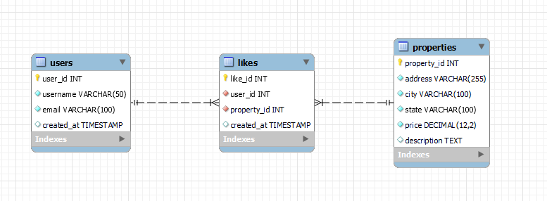

# Prueba Técnica de Habi

## Tecnologías Utilizadas

Para este proyecto, utilizaremos las siguientes tecnologías:

- Python 3.9+
- MySQL para interacciones con la base de datos
- pytest para pruebas unitarias
- JSON para el intercambio de datos

## Enfoque de Desarrollo

1. Configurar una estructura básica del proyecto
2. Implementar la conexión a la base de datos y funciones de consulta
3. Crear el microservicio de consulta de propiedades
4. Implementar la lógica de filtrado
5. Crear pruebas unitarias para todos los componentes
6. Diseñar el microservicio de "me gusta" (conceptual)
7. Crear scripts SQL para la función de "me gusta"
8. Documentar el código y crear los diagramas necesarios

## Preguntas y Resoluciones

1. P: ¿Cómo manejar las conexiones a la base de datos sin un ORM?
   R: Utilizaremos la biblioteca `mysql-connector-python` para establecer conexiones directas con la base de datos MySQL. Esto nos permite escribir consultas SQL en crudo mientras mantenemos el control sobre el ciclo de vida de la conexión.

2. P: ¿Cómo estructurar los microservicios sin un framework?
   R: Crearemos un servidor HTTP simple utilizando el módulo incorporado `http.server` de Python. Cada microservicio será un script de Python separado que maneja puntos finales específicos.

3. P: ¿Cómo implementar el filtrado en SQL en crudo?
   R: Utilizaremos la construcción dinámica de consultas SQL basadas en los filtros proporcionados. Aseguraremos el uso de consultas parametrizadas para prevenir la inyección de SQL.

## Extensión SQL para la Función de "Me Gusta"

La forma en la que la añadiria la tabla a la actual base de datos seria de la siguiente manera



```sql
CREATE TABLE like (
    id INT AUTO_INCREMENT PRIMARY KEY,
    property_id INT NOT NULL,
    user_id INT NOT NULL,
    created_at DATETIME NOT NULL DEFAULT CURRENT_TIMESTAMP,
    FOREIGN KEY (property_id) REFERENCES property(id),
    FOREIGN KEY (user_id) REFERENCES auth_user(id),
    UNIQUE (property_id, user_id)
);

CREATE INDEX idx_like_property ON like(property_id);
CREATE INDEX idx_like_user ON like(user_id);

```


## Ejecución del Proyecto

1. Clonar el repositorio
2. Instalar dependencias: `pip install -r requirements.txt`
3. Configurar archivo .env
4. Ejecutar : `python run.py`
5. Ejecutar pruebas: `pytest`

# Configuración del Proyecto

Este proyecto requiere un archivo de configuración `.env` para definir las variables de entorno necesarias para la conexión a la base de datos y otros ajustes. A continuación, se describen los pasos para configurar el archivo `.env`.

## Configuración del Archivo `.env`

Crea un archivo llamado `.env` en el directorio raíz del proyecto y añade las siguientes variables de entorno:

```ini
HOST="1.111.111.11"
PORT=1111
USER="user"
PASSWORD="password"
DATABASE="db"
```